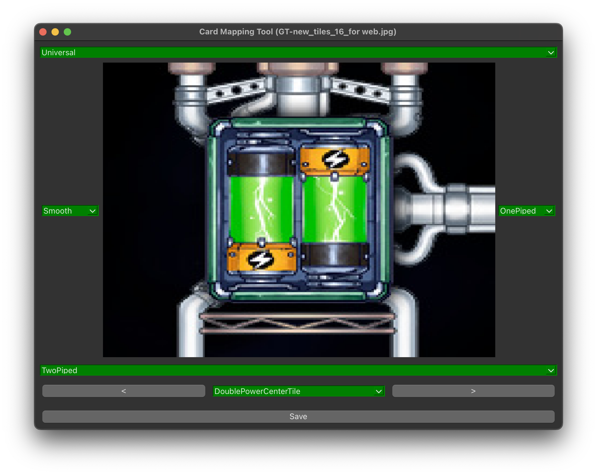

# Card Mapping Tool v.0.1 by Manchineel

È necessario mettere i tile unzippati in una cartella chiamata "tiles" nella cartella del progetto.

## Dipendenze
Dipendenze installabili con Poetry:
- `python3 -m pip install poetry`
- `poetry install`
- `poetry shell`

## Esecuzione
Per eseguire: `python3 -m card_mapping_tool`